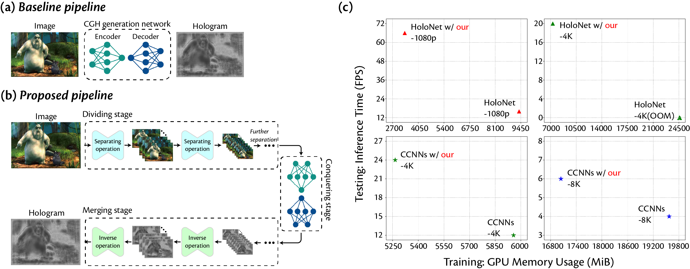

## Divide-Conquer-and-Merge: Memory- and Time-Efficient Holographic Displays

> We proposed a divide-conquer-and-merge strategy to address the memory and computational capacity scarcity in ultra-high-definition CGH generation. This algorithm empowers existing CGH frameworks to synthesize higher-definition holograms at a faster speed while maintaining high-fidelity image display quality. Both simulations and experiments were conducted to demonstrate the capabilities of the proposed framework. By integrating our strategy into HoloNet and CCNNs, we achieved significant reductions in GPU memory usage during the training period by 64.3% and 12.9%, respectively. Furthermore, we observed substantial speed improvements in hologram generation, with an acceleration of up to 3x and 2x, respectively. Particularly, we successfully trained and inferred 8K definition holograms on an NVIDIA GeForce RTX 3090 GPU for the first time in simulations. Furthermore, we conducted full-color optical experiments to verify the effectiveness of our method. We believe our strategy can provide a novel approach for memory- and time-efficient holographic displays

## Setup 
Install the required packages using conda with the provided [environment.yaml](https://github.com/Zhenxing-Dong/Memory-and-Time-Efficient-Hologram-Generation/blob/main/environment.yaml) file.

## Train
    python train_holonet.py --channel <CHANNEL_OF_LIGHT> --run_id <EXPERIMENT_NAME> --num_epochs <EPOCHS_NUM> --lr <LEARNING_RATE> --loss_fun <LOSS_FUNCTION> --perfect_prop_model True --method <METHOD> --scale_factor <SCALE_FACTOR_OF_PIXEL_SHUFFLE> --res <IMAGE_DEFINITION>
## Test
    python main.py --channel <CHANNEL_OF_LIGHT> --method <METHOD> --res <IMAGE_DEFINITION> --scale_factor <SCALE_FACTOR_OF_PIXEL_SHUFFLE> --checkpoint <NAME_OF_TRAINED_CHECKPOINT>

## Citation
If you use this code and find our work valuable, please cite our paper.

    @INPROCEEDINGS{10494141,
          author={Dong, Zhenxing and Jia, Jidong and Li, Yan and Ling, Yuye},
          booktitle={2024 IEEE Conference Virtual Reality and 3D User Interfaces (VR)}, 
          title={Divide-Conquer-and-Merge: Memory- and Time-Efficient Holographic Displays}, 
          year={2024},
          volume={},
          number={},
          pages={493-501},
          keywords={Training;Image quality;Solid modeling;Three-dimensional displays;Computational modeling;Neural networks;Graphics processing units;Holography;User interfaces;Optical imaging;VR/AR;Holographic             Displays;Computer-generated Hologram},
          doi={10.1109/VR58804.2024.00070}
      }

      @misc{dong2024,
      title={Divide-Conquer-and-Merge: Memory- and Time-Efficient Holographic Displays}, 
      author={Zhenxing Dong and Jidong Jia and Yan Li and Yuye Ling},
      year={2024},
      eprint={2404.10777},
      archivePrefix={arXiv},
      primaryClass={eess.IV}
    }

    
## Acknowledgement
The codes are built on [neural holography](https://github.com/computational-imaging/neural-holography). We sincerely appreciate the authors for sharing their codes.

## Contact
If you have any questions, please do not hesitate to contact [d_zhenxing@sjtu.edu.cn](d_zhenxing@sjtu.edu.cn).
